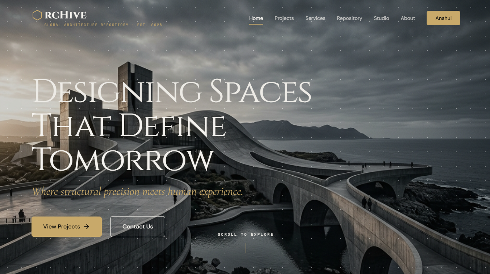

# ArcHive | Global Architecture Repository

<div align="center">
  
  
  [](https://react.dev/)
  [](https://vitejs.dev/)
  [](https://tailwindcss.com/)
  [](https://www.framer.com/motion/)
  
  **"Where Structure Meets Vision"**
</div>

---

## 🏛️ Project Vision
ArcHive is a premium digital preservation platform and collaborative vault for the architectural world. Functioning as a **"GitHub for Architects"**, it provides a space where blueprints, structural concepts, and visionary designs—ranging from contemporary brutalism to organic modernism—are indexed, forked, and celebrated.

ArcHive isn't just a portfolio; it's a global infrastructure for architectural intelligence.

---

## 🔐 Demo Credentials
To explore the authenticated features (Profile, Insights, Settings), use the following credentials:

| Identity | Email | Password |
| :--- | :--- | :--- |
| **Architect Demo** | `demo@archive.com` | `archive2026` |

---

## ✨ Core Features

### 🔍 Discovery Engine (Projects Feed)
A highly sophisticated filtering system that allows users to traverse the global repository based on typology, scale, and materiality.
- **Multi-Category Navigation:** Filter by Residential, Commercial, Heritage, and more.
- **Dynamic View Modes:** Toggle between editorial Grid, detailed List, and technical Compact views.
- **Metadata Transparency:** Every project card displays key technical data points (Location, Year, Area) at a glance.

### 👤 Professional Profile System (`/profile/me`)
A comprehensive identity management suite for architects.
- **Contribution Heatmap:** A GitHub-inspired 52-week activity graph tracking structural contributions.
- **Pinned Projects:** Showcase your finest work at the top of your profile.
- **Specializations & Tools:** Display your technical stack (Revit, Rhino, Grasshopper) and architectural focus areas.
- **Data Insights:** Track views, saves, and forks over time with dynamic charting.

### 📐 Project Detail Ecosystem
A deep-dive interface designed for architectural scrutiny.
- **Technical Sidebar:** Sticky container providing author verification, license data, and structural statistics.
- **Interactive Gallery:** High-resolution asset viewer with staggered animations.
- **Asset Vault:** A dedicated section for downloading blueprints, 3D models (DWG/ZIP), and high-fidelity renders.

### 🌓 Intelligent Navbar (Theme Detection)
The navigation system utilizes a sophisticated viewport-based detection algorithm to ensure 100% legibility.
- **Contrast Awareness:** Automatically switches between `light` and `dark` themes depending on the background brightness of the current section.

### 🛡️ Secure Session Management
- **Danger Zone:** Protocols for secure session termination (Logout) and permanent account deletion with double-confirmation modals.
- **Persistent Auth:** Session persistence using `localStorage` integrated with dynamic routing.

---

## 🎨 Design System Specifications

### Color Palette
| Token | HEX | Usage |
| :--- | :--- | :--- |
| **Primary BG** | `#F5F3EF` | Main off-white canvas/editorial sections |
| **Dark BG** | `#0E0E0C` | Hero sections and footer |
| **Accent Gold** | `#C8A96A` | Brand identity, icons, and primary CTAs |
| **Text Primary**| `#1A1A1A` | High-contrast body copy |

### Typography Hierarchy
- **H1 - H2:** `Cinzel` (Monumental Structural Serif)
- **H3 - H4:** `Cormorant Garamond` (Elegant Editorial Serif)
- **Body:** `DM Sans` (Clean Modern Sans-Serif)
- **Data/UI:** `Space Mono` (Technical Monospace)

---

## 🚀 Technical Architecture

### Stack Components
- **Framework:** React 19
- **Build Tool:** Vite
- **Styling:** Tailwind CSS 3
- **Animation Engine:** Framer Motion (Hardware-accelerated)
- **Iconography:** Lucide React

### Directory Structure
```text
src/
├── components/     # Reusable UI elements (Navbar, HexPattern, etc.)
├── data/           # Mock data and project repositories
├── pages/          # Full-page components (Home, Projects, Profile, Auth)
├── assets/         # Global styles and static resources
└── App.jsx         # Root component with dynamic routing
```

---

## 🛠️ Installation & Setup

1. **Clone the repository:**
   ```bash
   git clone https://github.com/anshul4510/ArcHive.git
   cd ArcHive
   ```

2. **Install dependencies:**
   ```bash
   npm install
   ```

3. **Run the development server:**
   ```bash
   npm run dev
   ```

---

## Tracks
- [x] **User Authentication:** Architecture profile management.
- [x] **Activity Heatmap:** Contribution tracking system.
- [ ] **Design Forking:** Ability to create personal versions of public blueprints.
- [ ] **3D Viewer Integration:** Embedded Three.js viewer for DWG/OBJ assets.

---

<div align="center">
  <p>© 2026 ArcHive Global Architecture Repository. All rights reserved.</p>
</div>
