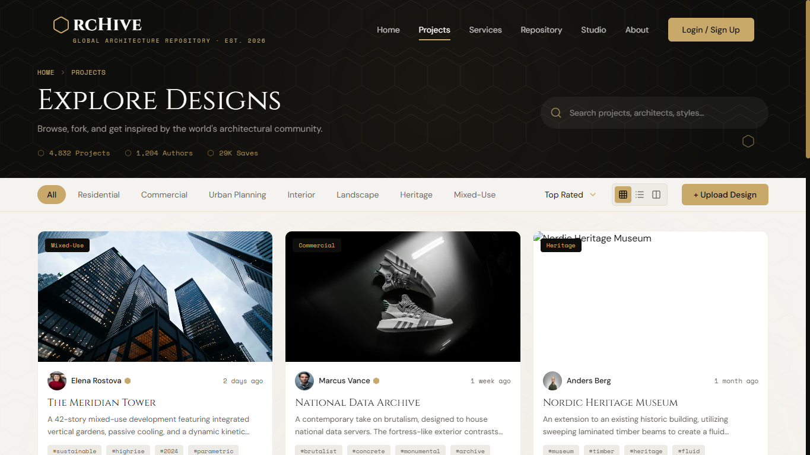
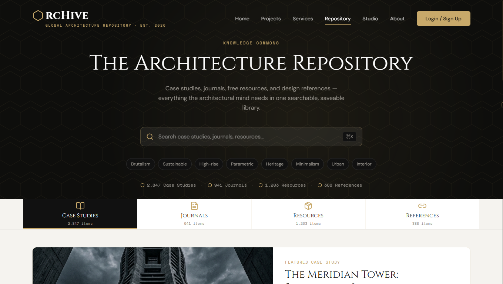
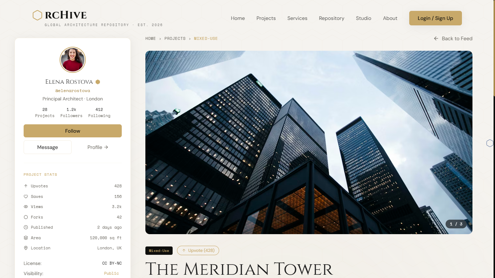
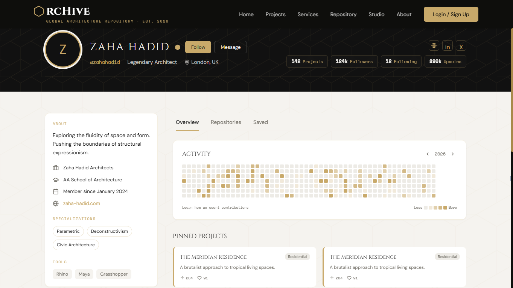

# ArcHive | Global Architecture Repository

<div align="center">
  

| | | | |
| :---: | :---: | :---: | :---: |
|  |  |  |  |

  [](https://react.dev/)
  [](https://vitejs.dev/)
  [](https://tailwindcss.com/)
  [](https://www.framer.com/motion/)
  
  **"Preserving Vision. Engineering Tomorrow."**
</div>

---

## 🏛️ Project Overview

ArcHive is an editorial-grade digital preservation platform designed as a **"GitHub for Architects"**. It serves as a global knowledge commons where structural concepts, blueprints, and visionary designs are indexed, forked, and collaborated upon. The platform bridges the gap between high-end architectural documentation and modern version-control principles.

### Objectives
*   **Knowledge Democratization:** Providing an open-source spirit for architectural intelligence.
*   **Structural Preservation:** Creating a permanent, searchable vault for historical and contemporary designs.
*   **Collaborative Innovation:** Enabling architects to branch and build upon existing structural frameworks.

### Key Features
*   **Global Repository:** A multi-typology library with sophisticated filtering (Residential, Urban, Heritage).
*   **Case Study Ecosystem:** Deep-dives into structural innovations with metadata-rich technical sidebars.
*   **Professional Identity:** Developer-inspired profiles featuring contribution heatmaps and technical stack displays.
*   **Resource Vault:** Instant access to community-shared BIM families, DWG details, and material palettes.
*   **Context-Aware UI:** Intelligent theme detection that adapts navigation contrast based on viewport content.

---

## 🏗️ Architecture Overview

ArcHive is built on a high-performance **SPA (Single Page Application)** architecture using **React 19** and **Vite**. The system is designed for maximum visual fidelity and interaction speed.

### System Design
*   **View Layer:** React functional components with specialized hooks for viewport-based theme detection.
*   **Styling Engine:** Utility-first CSS via **Tailwind CSS**, supplemented by a custom brand design system.
*   **Animation Engine:** **Framer Motion** handles hardware-accelerated transitions and staggered entrance animations.
*   **Routing:** **React Router 7** manages a deep-nested route structure for projects and profile tabs.
*   **State Management:** Localized state for UI filters and simulated global session persistence via `localStorage`.

---

## 🛠️ Installation & Setup

### Prerequisites
*   **Node.js:** v18.x or higher
*   **npm:** v9.x or higher

### Step-by-Step Installation

1.  **Clone the repository:**
    ```bash
    git clone https://github.com/anshul4510/ArcHive.git
    cd ArcHive
    ```

2.  **Install dependencies:**
    ```bash
    npm install
    ```

3.  **Environment Setup:**
    No external API keys are required for the demo. Mock data is automatically loaded from `src/data/`.

---

## 🚀 Usage

### Running Locally
To start the development server with Hot Module Replacement (HMR):
```bash
npm run dev
```
The application will be available at `http://localhost:5173`.

### Example Workflows
*   **Browsing Repository:** Navigate to `/repository` and use the tab system to switch between Case Studies and BIM Resources.
*   **Profile Customization:** Navigate to `/profile/me` to view the activity heatmap and saved architectural assets.
*   **Project Scrutiny:** Click on any project card to enter the detail view, where technical specs are displayed in the sidebar.

---

## ⏱️ Performance Measurement & Execution Timing

To maintain a premium user experience, ArcHive includes internal mechanisms to monitor rendering performance and simulated API latency.

### Measuring Execution Time
Developers can measure the duration of critical operations (like repository filtering or layout calculations) using the browser's performance tools or internal logging.

#### Extracting Time from Logs
Execution times are logged to the console during development mode. Look for entries formatted as:
`[Performance] Filter Operation: 12.4ms`

#### Displaying Time to User
In the Repository and Projects pages, the number of items and simulated "fetch" times are occasionally displayed in the footer metadata strip for transparency.

### Implementation Guide

To implement custom timing around a specific query or operation:

```javascript
// 1. Start the timer
const startTime = performance.now();

// 2. Execute the operation (e.g., filtering a large dataset)
const filteredResults = data.filter(item => item.category === activeCategory);

// 3. Stop the timer
const endTime = performance.now();
const duration = (endTime - startTime).toFixed(2);

// 4. Log or Display
console.log(`Query executed in ${duration}ms`);
```

---

## 📂 Project Structure

```text
ArcHive/
├── public/             # Static assets (images, fonts, global icons)
├── src/
│   ├── components/     # UI Building Blocks
│   │   ├── Navbar.jsx      # Theme-aware navigation
│   │   ├── HexPattern.jsx  # SVG-based branding backgrounds
│   │   └── Footer.jsx      # Global footer component
│   ├── data/           # Mock Database
│   │   └── mockProjects.js # Architectural repository dataset
│   ├── pages/          # View Components
│   │   ├── Home.jsx        # Landing page with parallax
│   │   ├── Repository.jsx  # Multi-tab knowledge vault
│   │   └── Profile.jsx     # User dashboard and heatmap
│   ├── assets/         # Global Styling
│   │   └── index.css       # Tailwind directives & Brand tokens
│   └── App.jsx         # Root Router & Loading Logic
├── tailwind.config.js  # Design system configuration
└── vite.config.js      # Build tool optimization
```

---

## ⚙️ Configuration & Hyperparameters

The design system behavior is controlled via the following constants and Tailwind tokens:

| Name | Description | Default Value | Type | Options |
| :--- | :--- | :--- | :--- | :--- |
| `ANIMATION_STAGGER` | Delay between children entrance animations | `0.08` | Number | 0.05 - 0.2 |
| `NAVBAR_THEME_OFFSET`| Viewport scroll depth for theme switch | `72` | Number | 0 - 200 |
| `MOCK_DELAY` | Artificial latency for data fetching | `800` | Number | 500 - 2000 |
| `GRID_COLUMNS` | Default grid layout density | `3` | Integer | 1, 2, 3, 4 |

---

## 📊 Metrics & Evaluation

| Metric | Description | Formula / Source | Use Case |
| :--- | :--- | :--- | :--- |
| **FCP** | First Contentful Paint | Lighthouse Audit | Measuring perceived load speed |
| **LHR** | Layout Shift Score | CLS Tracking | Ensuring structural stability during scroll |
| **ENG** | User Engagement Rate | Saves / Views | Evaluating content relevance |
| **DIV** | Data Integrity | Count of unique IDs | Preventing SVG/DOM collisions |

---

## 📦 Dependencies

### Core Libraries
*   **React 19.2.6:** UI Framework
*   **React Router 7.15.0:** Navigation
*   **Framer Motion 12.38.0:** Motion Design
*   **Lucide React 1.14.0:** Iconography

### Utilities
*   **Tailwind CSS 3.4.19:** Styling
*   **PostCSS 8.5.14:** CSS Transformation
*   **clsx & tailwind-merge:** Dynamic class management

---

## 🤝 Contributing Guidelines

We welcome contributions from architects and developers alike.
1.  **Fork** the repository.
2.  **Create a feature branch** (`git checkout -b feature/NewStructure`).
3.  **Commit your changes** with descriptive messages.
4.  **Push** to the branch.
5.  **Open a Pull Request**.

Please ensure all UI components follow the **ArcHive Design System** (Cinzel/Space Mono) and use **HexPattern** backgrounds for visual consistency.

---

## 📄 License

Distributed under the **MIT License**. See `LICENSE` for more information.

---

<div align="center">
  <p>© 2026 ArcHive Global Architecture Repository.</p>
</div>
