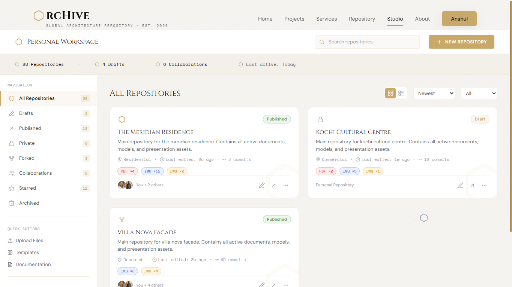
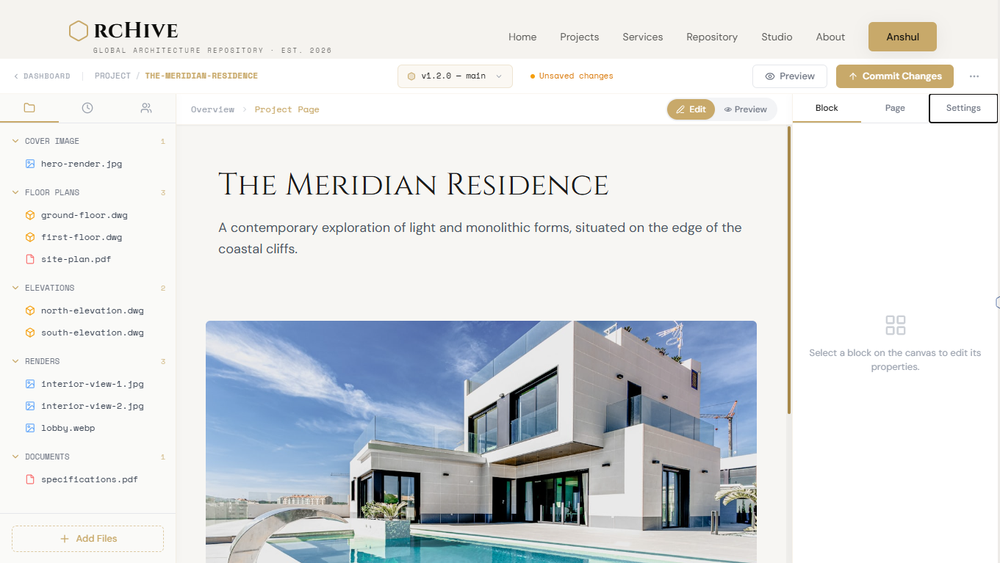
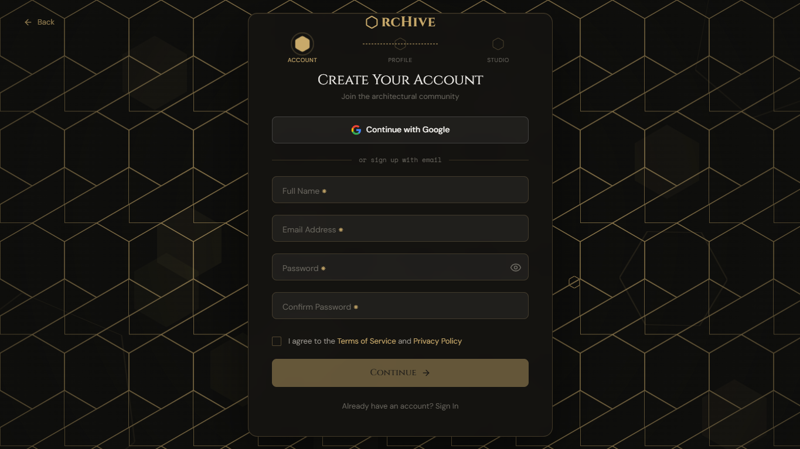
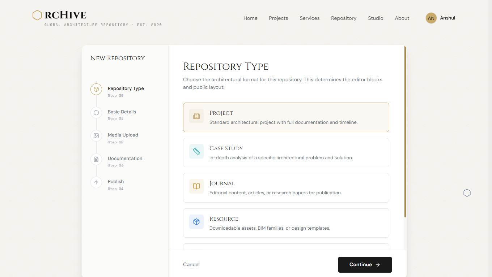
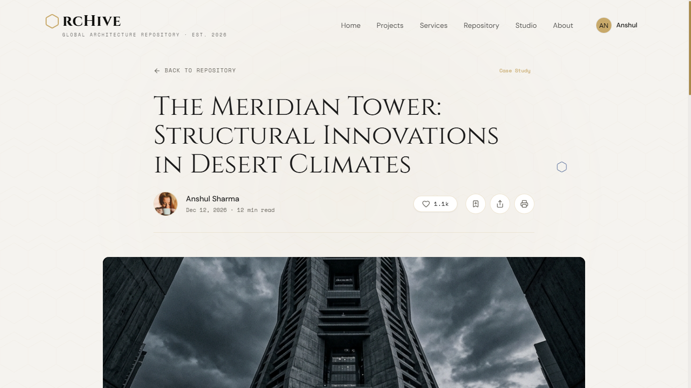

# ArcHive | Global Architecture Repository

<div align="center">
  

| | | |
| :---: | :---: | :---: |
|  |  |  |
| **Editorial Feed** | **Project Detail** | **Repository Index** |
|  |  |  |
| **Studio Dashboard** | **Drafting Workspace** | **Auth Guard (Golden Lock)** |
|  |  |  |
| **Type Selection Wizard** | **Unified Reader Actions** | **Settings & Danger Zone** |

  [](https://react.dev/)
  [](https://vitejs.dev/)
  [](https://tailwindcss.com/)
  [](https://www.framer.com/motion/)
  
  **"Preserving Vision. Engineering Tomorrow."**
</div>

---

## 🏛️ Project Overview

ArcHive is an editorial-grade digital preservation platform designed as a **"GitHub for Architects"**. It serves as a global knowledge commons where structural concepts, blueprints, and visionary designs are indexed, forked, and collaborated upon. The platform bridges the gap between high-end architectural documentation and modern version-control principles.

### Objectives
*   **Knowledge Democratization:** Providing an open-source spirit for architectural intelligence.
*   **Structural Preservation:** Creating a permanent, searchable vault for historical and contemporary designs.
*   **Collaborative Innovation:** Enabling architects to branch (fork) and build upon existing structural frameworks.

### Key Features
*   **Global Repository & Case Study Index:** Multi-typology libraries with sophisticated filtering systems (Residential, Urban, Heritage, etc.).
*   **Developer-Inspired Profiles:** Technical profile settings featuring follow systems, active contribution heatmaps, and customizable toolstacks.
*   **ArcHive Studio:** A professional workspace (architectural IDE) with a block-based drafting editor and type-aware repository creation wizard.
*   **Decoupled Multi-Provider Auth Flow**: Advanced integration combining Firebase Authentication (OAuth & Email/Password) and Supabase database policies.
*   **Secured Delete Account Transaction**: Strict transactional deletion workflow requiring recent-login reauthentication, ensuring Firebase Auth and Supabase RLS profiles are deleted atomic-style without creating orphaned accounts.
*   **Version Control & Collaboration**: Commit tracking, repository forks, and user comment/upvote interaction frameworks.

---

## 📂 Content Type System

ArcHive enforces a strict typology to ensure architectural data is indexed correctly. The content type is selected at creation and remains locked post-publication to maintain routing integrity.

| Type | Icon | Purpose | Key Metadata |
| :--- | :--- | :--- | :--- |
| **Project** | `Building2` | Standard architectural documentation | Site Area, Floor Count, Budget |
| **Case Study**| `Ruler` | Technical analysis & problem solving | Research Focus, Climate, Solutions |
| **Journal** | `BookOpen` | Editorial articles & research papers | Peer Review Status, Publication Date |
| **Resource** | `Package` | BIM families, CAD details, Templates | File Format, Software Version |
| **Reference** | `LinkIcon` | Curated specifications & reading lists| Source URL, DOI, ISBN |

---

## 🏗️ Architecture Overview

ArcHive is built on a high-performance **SPA (Single Page Application)** architecture using **React 19** and **Vite**. Below is a high-level visual representation of the authentication and database data flow.

```mermaid
graph TD
    Client[React SPA Client] -->|1. Authenticates / Obtains Token| Firebase[Firebase Auth Provider]
    Client -->|2. Syncs Auth Session (RPC)| Supabase[Supabase Database]
    Client -->|3. Uploads Static Assets| Cloudinary[Cloudinary Media Storage]
    
    subgraph Supabase Security Layer
        Supabase -->|set_firebase_uid RPC| RLS{Row-Level Security Policies}
        RLS -->|Permit Delete / Select| UsersTable[(users Table)]
        RLS -->|Permit Edit / Fork| ProjectsTable[(projects Table)]
        RLS -->|Cascades Actions| ChildTables[(user_specializations / comments / tools)]
    end
```

### High-Level System Design
*   **Frontend SPA**: A single-page client built with React 19. Runs a deep-nested route structure managed by React Router 7.
*   **Authentication & Reauthentication**: Powered by Firebase Auth. Sensitive account functions (such as deletion) employ a strict transactional flow where Firebase reauthentication checks occur prior to deleting Supabase RLS rows.
*   **Database Management**: Hosted on Supabase. Uses custom Row Level Security (RLS) policies evaluated by mapping Firebase user tokens via a custom database session variable (`set_firebase_uid`).
*   **Asset Management**: Images, blueprints, and files are hosted securely on Cloudinary and mapped directly to Supabase metadata nodes.

---

## 🛠️ Installation & Setup

### Prerequisites
*   **Node.js**: v18.x or higher (v22.x recommended)
*   **npm**: v9.x or higher
*   **Firebase Project**: An active project with Email/Password and Google sign-in enabled.
*   **Supabase Instance**: A PostgreSQL database containing the custom schema and RPC functions.

### Step-by-Step Installation

1.  **Clone the repository:**
    ```bash
    git clone https://github.com/anshul4510/ArcHive.git
    cd ArcHive
    ```

2.  **Install dependencies:**
    ```bash
    npm install
    ```

3.  **Environment Setup:**
    Create a `.env` file in the root directory and copy variables from `.env.example`:
    ```ini
    VITE_FIREBASE_API_KEY=your_firebase_api_key
    VITE_FIREBASE_AUTH_DOMAIN=your_firebase_auth_domain
    VITE_FIREBASE_PROJECT_ID=your_firebase_project_id
    VITE_FIREBASE_STORAGE_BUCKET=your_firebase_storage_bucket
    VITE_FIREBASE_MESSAGING_SENDER_ID=your_firebase_messaging_sender_id
    VITE_FIREBASE_APP_ID=your_firebase_app_id
    VITE_SUPABASE_URL=https://your-project-ref.supabase.co
    VITE_SUPABASE_ANON_KEY=your_supabase_anonymous_key
    ```

---

## 🚀 Usage

### Running Locally
To start the development server with Hot Module Replacement (HMR):
```bash
npm run dev
```
The application will default to `http://localhost:5173`.

### Example Workflows

#### Deleting an Account (Security Verification)
1. Go to the **Profile** page (`/profile/me`), select the **Settings** tab, and scroll to the danger zone.
2. Click **Delete Account**.
3. If the active login session is fresh, the system will process the deletion immediately.
4. If the active login session is old, the modal shifts to a security state requesting reauthentication:
   - For **Email/Password** users: Confirm your current password.
   - For **Google** users: Click **Reauthenticate with Google** to open the OAuth popup window.
5. Once verified, the system deletes your account from Firebase first, then cascades-deletes all associated data in Supabase.

#### Creating a New Architectural Repository
1. Navigate to the **Studio** (`/studio`) and click **New Repository**.
2. Select your typography from the Content Type System wizard.
3. Configure the specific project metadata, upload blueprints, and click **Publish**.

---

## ⏱️ Performance Measurement & Execution Timing

ArcHive utilizes explicit performance timers to measure the execution latency of complex operations such as Supabase RPC lookups, client-side repository queries, and large dataset formatting.

### Instructions to Monitor and Extract Timings

#### 1. Extracting Execution Time from Logs
During development mode, performance measurements are piped to the developer console. To view these:
1. Open your browser developer tools (F12) and go to the **Console** tab.
2. Filter the console output by searching for the prefix `[Performance]`.
3. Example log format:
   `[Performance] supabase.fetchProjects executed in 143.20ms`

#### 2. Displaying Execution Time to the User
Critical performance indicators can be rendered dynamically in the UI (e.g., metadata footers). The component saves the duration in a state variable and displays it:
```jsx
<span className="font-mono text-[11px] text-[#6B6860]">
  Query compiled in {queryDuration}ms
</span>
```

### Implementing Timing Code Wrappers
To measure a specific backend call or client operation, wrap the query block using `performance.now()`:

```javascript
import { supabase } from './supabase';

/**
 * Fetch projects with execution time tracking
 * @param {string} category 
 * @returns {Promise<{data: Array, duration: string, error: any}>}
 */
export async function fetchProjectsTimed(category) {
  // A. Record start timestamp
  const startTime = performance.now();
  
  try {
    const { data, error } = await supabase
      .from('projects')
      .select('*')
      .eq('category', category);
      
    // B. Record stop timestamp
    const endTime = performance.now();
    const duration = (endTime - startTime).toFixed(2);
    
    // C. Log the result
    console.log(`[Performance] fetchProjectsTimed executed in ${duration}ms`);
    
    return { data, duration, error };
  } catch (err) {
    const endTime = performance.now();
    console.error(`[Performance] fetchProjectsTimed failed after ${(endTime - startTime).toFixed(2)}ms`);
    return { data: null, duration: '0.00', error: err };
  }
}
```

---

## 📂 Project Structure

```text
ArcHive/
├── public/                 # Static assets, logos, and global illustrations
├── src/
│   ├── components/         # Reusable UI Components
│   │   ├── AvatarDisplay.jsx   # Customizable user profile avatar component
│   │   ├── ToastContext.jsx    # Global context provider for toast notifications
│   │   └── HexPattern.jsx      # Brand patterns using dynamic SVGs
│   ├── context/            # Application State Contexts
│   │   └── AuthContext.jsx     # Handles authentication listeners, profile syncing, and auth exports
│   ├── lib/                # Database and API services
│   │   ├── firebase.js         # Core Firebase configuration and initialization
│   │   ├── supabase.js         # Core Supabase client initialization
│   │   ├── auth.js             # Supabase and Firebase Auth wrappers (signups, logins, and accounts delete)
│   │   ├── profile.js          # Fetch and update profiles, interests, and connections
│   │   └── projects.js         # Database CRUD wrappers (projects, comments, file uploads, upvotes)
│   ├── pages/              # Routed Views
│   │   ├── Home.jsx            # Product landing page with visual features
│   │   ├── Repository.jsx      # Technical indexing page for public resources
│   │   ├── Profile.jsx         # User profiles containing contribution heatmaps and settings tabs
│   │   ├── Studio.jsx          # Creation wizards and repository drafting controls
│   │   └── ReaderPage.jsx      # High-fidelity layout for reading technical journals and cases
│   ├── assets/             # Styling stylesheets
│   │   └── index.css           # Core brand design system configurations
│   ├── App.jsx             # Entry route mapping and initialization routines
│   └── main.jsx            # DOM mounting controller
├── tailwind.config.js      # CSS configuration guidelines
└── vite.config.js          # Client build parameters
```

---

## ⚙️ Configuration & Hyperparameters

Below is a summary of configuration hyperparameters that control application behaviors:

| Name | Description | Default Value | Type | Range / Options |
| :--- | :--- | :--- | :--- | :--- |
| `VITE_SUPABASE_URL` | Endpoint URL of the backend database engine | *None* | String | URL format |
| `VITE_FIREBASE_PROJECT_ID` | Project Identifier for Firebase services | *None* | String | Alphanumeric |
| `MOCK_DELAY` | Latency simulation parameter for local testing environments | `800` | Integer | `0 - 5000` (ms) |
| `ANIMATION_STAGGER` | Grid dynamic load animation stagger factor | `0.08` | Float | `0.01 - 0.50` (seconds) |
| `NAVBAR_THEME_OFFSET` | Page scroll depth triggering dark/light nav style modifications | `72` | Integer | `0 - 500` (pixels) |
| `CHUNK_SIZE_LIMIT` | Max allowed size for production asset compiler warning | `500` | Integer | `100 - 2000` (kB) |
| `PAGINATION_DEFAULT_LIMIT` | Default rows fetched per page for public project feeds | `12` | Integer | `5 - 100` |

---

## 📊 Metrics & Evaluation

ArcHive evaluates system health, asset rendering, and database latency using the following KPIs:

| Metric | Description | Formula / Evaluation Path | Use Case |
| :--- | :--- | :--- | :--- |
| **QL** | Database Query Latency | $T_{end} - T_{start}$ for client database operations | Tracking database indexing performance |
| **FCP** | First Contentful Paint | Browser Performance Timeline API | Evaluating load speeds |
| **CLS** | Cumulative Layout Shift | Layout Instability API | Checking visual consistency on content load |
| **INP** | Interaction to Next Paint | Event timing measurements for clicks/taps | Profiling client-side input lag |
| **DEL_S** | Account Deletion Success Rate | $\frac{\text{Successful Deletions}}{\text{Total Deletion Attempts}} \times 100$ | Monitoring transactional auth deletion |

---

## 📦 Dependencies

### Production Dependencies
*   `react` (v19.2.6): Declarative UI framework
*   `react-dom` (v19.2.6): DOM renderer
*   `react-router-dom` (v7.15.1): Router mapping
*   `firebase` (v12.13.0): OAuth, email/password credentials provider
*   `@supabase/supabase-js` (v2.105.4): DB connection client
*   `framer-motion` (v12.38.0): Production visual transitions
*   `lucide-react` (v1.14.0): Clean vector iconography set
*   `date-fns` (v4.2.1): Time and calendar formatting utility
*   `cloudinary` (v2.10.0): Image asset upload engine
*   `react-image-crop` (v11.0.10): Visual blueprint cropping interface

### Developer Tools
*   `vite` (v8.0.12): Dynamic ESM compiler and bundler
*   `tailwindcss` (v3.4.19): Styling engine
*   `eslint` (v10.3.0): Static analysis code validation framework
*   `postcss` (v8.5.14): Styling compilation rules
*   `playwright` (v1.60.0): Headless end-to-end integration test runner

---

## 🤝 Contributing Guidelines

We welcome contributions to ArcHive. To submit changes:

1. **Fork the Repository**: Create an isolated copy of this project on your Github account.
2. **Setup a Feature Branch**:
   ```bash
   git checkout -b feature/your-awesome-feature
   ```
3. **Write Clean Code**: Follow existing layout and naming styles. Run linting tools before committing:
   ```bash
   npm run lint
   ```
4. **Commit & Push**:
   ```bash
   git commit -m "feat: descriptive commit message"
   git push origin feature/your-awesome-feature
   ```
5. **Open a Pull Request**: Detail your changes, testing paths, and UI modifications.

---

## 📄 License

This project is licensed under the **MIT License**. See the `LICENSE` file for more details.

---

<div align="center">
  <p>© 2026 ArcHive Global Architecture Repository. All Rights Reserved.</p>
</div>
